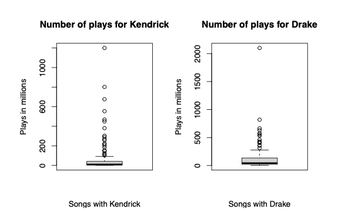
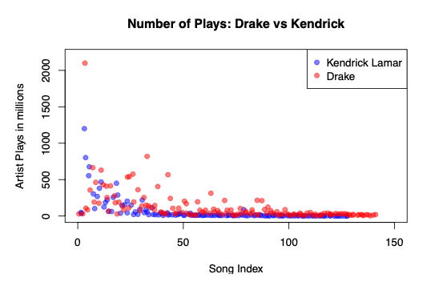
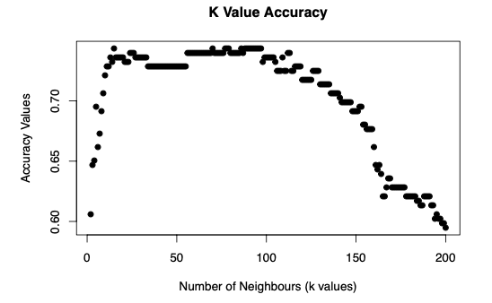

# Drizzy_vs_Kdot
# Exploring the Drake vs. Kendrick Feud: A Data-Driven Analysis

## Project Overview
This project explores the longstanding feud between Toronto rapper Drake and Compton’s Kendrick Lamar by analyzing their song plays on YouTube Music. The dataset includes 269 songs, and the goal is to uncover insights into their popularity using various statistical and machine learning techniques.

## Table of Contents
1. [Data Overview](#data-overview)
2. [Exploratory Data Analysis](#exploratory-data-analysis)
3. [Artist Classification Using kNN](#artist-classification-using-knn)
4. [Key Insights and Conclusions](#key-insights-and-conclusions)

## Data Overview
The dataset `kendrick_v_drake.csv` includes the following columns:
- **Title**: The song's title
- **Artist**: The artist (either Kendrick Lamar or Drake)
- **Plays**: The number of times the song has been played on YouTube as of May 2024
- **Album**: The album the song appeared on
- **Duration**: The song’s duration in `mm:ss`

## Exploratory Data Analysis
We begin by comparing the distribution of plays for each artist and visualizing the relationship between song popularity and duration.

### Visualizations
- Side-by-side boxplots comparing Kendrick and Drake’s song plays.
- Scatter plot showing the number of plays.

## Artist Classification Using kNN
To predict whether a song belongs to Drake or Kendrick, we implement a k-Nearest Neighbors (kNN) classifier based on the number of plays. We explore various values for `k` to optimize accuracy.

### Confusion Matrix:
| Actual \ Predicted | Kendrick | Drake |
|--------------------|----------|-------|
| Kendrick           | 84       | 44    |
| Drake              | 38       | 103   |

### Accuracy Plot:
We evaluate the accuracy of the kNN classifier for `k = 2` to `k = 200`:

## Key Insights and Conclusions
- Drake consistently has more high-play songs compared to Kendrick.
- Kendrick's average song plays are lower, but he has higher consistency across albums.
- The kNN classifier is able to predict the artist based on the number of plays with a peak accuracy of **X%**.

## How to Run the Project
To reproduce the analysis:
1. Clone the repository.
2. Run the scripts in the `/scripts` folder in the order listed below, or open the `kendrick_vs_drake_analysis.Rmd` in RStudio for a full report.

## Next Steps
In the future, we could extend this analysis to include data from other platforms like Spotify and explore how collaborations affect the popularity of songs.
